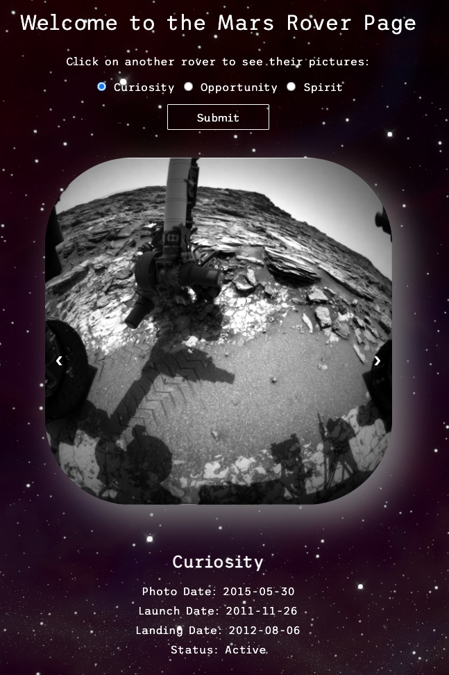

# Mars Rover Image Gallery

This is a Mars rover dashboard that consumes the NASA API. Select between Curiosity, Opportunity, and Spirit to see the most recent images taken by that rover, as well as important information about the rover and its mission. This app focuses on utilizing pure functions and iterating over, reshaping, and accessing information from complex API responses.

## Getting Started

1. After cloning the repository, install dependencies for this project by running `npm install`.

2. To access the NASA developer API endpoints, retrieve an API key from <https://api.nasa.gov/> and add to a local `.env` file.

3. Run `npm start` in the terminal and go to `http:localhost:3000` to use the app.

4. Page is also hosted at https://ljmccode.github.io/Mars-Rover/.

### Languages and Tools Used

* Functional JavaScript
* Node.js
* Express
* ImmutableJS
* NASA API
